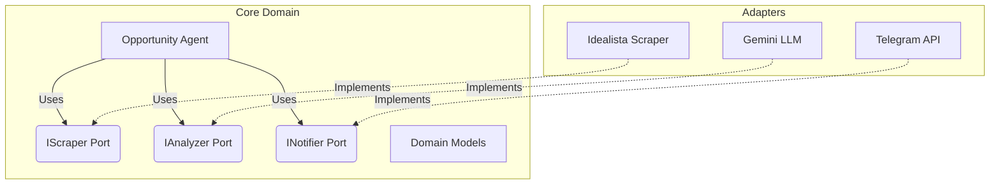

# Real Estate AI Agent 🕵️‍♂️🏠


An autonomous AI Agent designed to automate the discovery of undervalued real estate opportunities. It scrapes property listings (e.g., Idealista), analyzes their features using Large Language Models (LLMs), calculates their market viability, and sends real-time alerts via Telegram.

## 🏗 Architecture & Design Patterns

This project is built with scalability and maintainability in mind, strictly adhering to **Hexagonal Architecture (Ports & Adapters)** and **Domain-Driven Design (DDD)** principles.

### Why Hexagonal Architecture?
The core business logic (the "Agent") is completely isolated from external dependencies. It communicates with the outside world through strictly defined interfaces (**Ports**). 
If a website changes its DOM or we want to swap the AI provider from OpenAI to Gemini, we only need to write a new **Adapter**—the Core remains untouched.




## 🛠 Tech Stack

- **Language:** Python 3.10+
- **Code Quality:** [Ruff](https://docs.astral.sh/ruff/) (Linter & Formatter), [Mypy](https://mypy.readthedocs.io/) (Static Type Checking)
- **Scraping:** *(TBD - Playwright / BeautifulSoup)*
- **AI Integration:** *(TBD - Google Gemini / OpenAI)*

## 🚀 Getting Started

### Prerequisites
- Python >= 3.10
- Git

### Installation

1. **Clone the repository:**
   ```bash
   git clone https://github.com/yourusername/agente-scrapper.git
   cd agente-scrapper
   ```

2. **Create and activate a virtual environment:**
   ```bash
   python3 -m venv venv
   source venv/bin/activate  # On Windows use: venv\Scripts\activate
   ```

3. **Install dependencies:**
   ```bash
   pip install -e ".[dev]"
   ```

4. **Environment Variables:**
   Copy the example environment file and fill in your API keys:
   ```bash
   cp .env.example .env
   ```

## 🏃‍♂️ Usage

*(WIP - Usage instructions will be added once the CLI entrypoint is finalized)*
```bash
python src/main.py
```

## 🗺 Roadmap

- [x] Define Domain Models and Value Objects (DDD)
- [ ] Implement Interface Ports (Scraper, Analyzer, Notifier)
- [ ] Develop Idealista Web Scraper Adapter
- [ ] Develop LLM Analyzer Adapter (Gemini/OpenAI)
- [ ] Develop Telegram Notifier Adapter
- [ ] Add SQLite Repository for historical price tracking
- [ ] **Future:** Abstract domain to support other markets (e.g., PC Hardware/GPUs)

