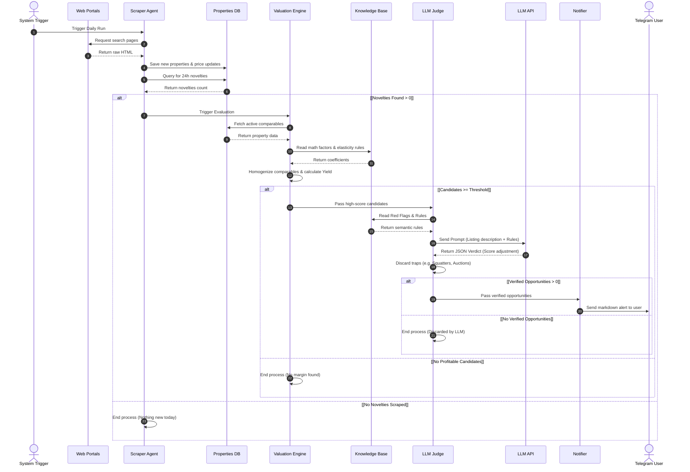

# Macroprocess: End-to-End Pipeline (Sequence)

```mermaid
%%{init: {'theme': 'default', 'themeVariables': { 'fontFamily': 'ui-sans-serif, system-ui, -apple-system, BlinkMacSystemFont, "Segoe UI", Roboto, "Helvetica Neue", Arial, sans-serif', 'fontSize': '15px' }}}%%
sequenceDiagram
    autonumber
    
    %% Actors and Participants
    actor Cron as System Trigger
    participant Web as Web Portals
    participant Scraper as Scraper Agent
    participant DB as Properties DB
    participant Val as Valuation Engine
    participant KB as Knowledge Base
    participant Judge as LLM Judge
    participant IA as LLM API
    participant Notif as Notifier
    actor TG as Telegram User

    %% ---------------------------------------------------
    Cron->>Scraper: Trigger Daily Run
    
    %% Phase 1: Data Collection
    Scraper->>Web: Request search pages
    Web-->>Scraper: Return raw HTML
    Scraper->>DB: Save new properties & price updates
    Scraper->>DB: Query for 24h novelties
    DB-->>Scraper: Return novelties count
    
    alt [Novelties Found > 0]
        Scraper->>Val: Trigger Evaluation
        
        %% Phase 2: Mass Valuation
        Val->>DB: Fetch active comparables
        DB-->>Val: Return property data
        Val->>KB: Read math factors & elasticity rules
        KB-->>Val: Return coefficients
        Val->>Val: Homogenize comparables & calculate Yield
        
        alt [Candidates >= Threshold]
            Val->>Judge: Pass high-score candidates
            
            %% Phase 3: Qualitative Filter
            Judge->>KB: Read Red Flags & Rules
            KB-->>Judge: Return semantic rules
            Judge->>IA: Send Prompt (Listing description + Rules)
            IA-->>Judge: Return JSON Verdict (Score adjustment)
            Judge->>Judge: Discard traps (e.g. Squatters, Auctions)
            
            alt [Verified Opportunities > 0]
                %% Phase 4: Notification
                Judge->>Notif: Pass verified opportunities
                Notif->>TG: Send markdown alert to user
            else [No Verified Opportunities]
                Judge->>Judge: End process (Discarded by LLM)
            end
            
        else [No Profitable Candidates]
            Val->>Val: End process (No margin found)
        end
        
    else [No Novelties Scraped]
        Scraper->>Scraper: End process (Nothing new today)
    end
```
