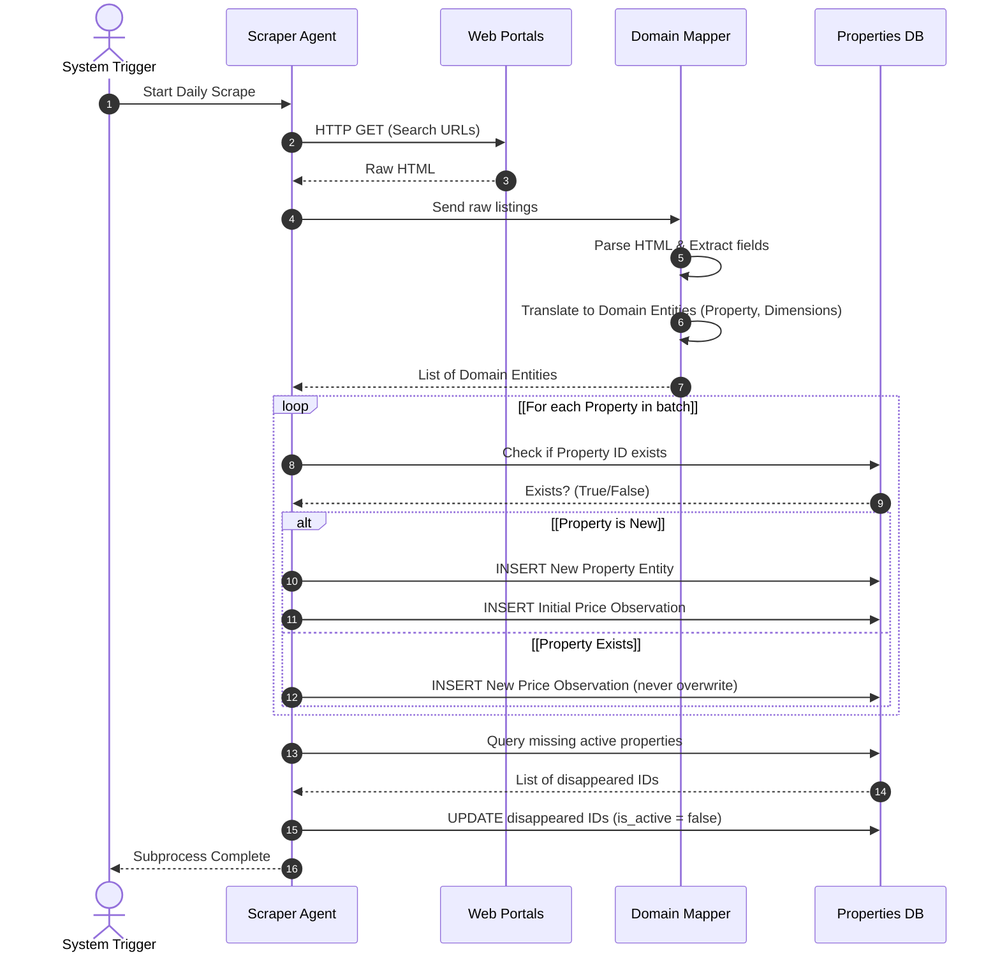

# Subprocess 1: Scraper & Persistence (Sequence)

```mermaid
%%{init: {'theme': 'default', 'themeVariables': { 'fontFamily': 'ui-sans-serif, system-ui, -apple-system, BlinkMacSystemFont, "Segoe UI", Roboto, "Helvetica Neue", Arial, sans-serif', 'fontSize': '15px' }}}%%
sequenceDiagram
    autonumber
    
    actor Cron as System Trigger
    participant Scraper as Scraper Agent
    participant Web as Web Portals
    participant Mapper as Domain Mapper
    participant DB as Properties DB

    Cron->>Scraper: Start Daily Scrape
    
    Scraper->>Web: HTTP GET (Search URLs)
    Web-->>Scraper: Raw HTML
    
    Scraper->>Mapper: Send raw listings
    Mapper->>Mapper: Parse HTML & Extract fields
    Mapper->>Mapper: Translate to Domain Entities (Property, Dimensions)
    Mapper-->>Scraper: List of Domain Entities
    
    loop [For each Property in batch]
        Scraper->>DB: Check if Property ID exists
        DB-->>Scraper: Exists? (True/False)
        
        alt [Property is New]
            Scraper->>DB: INSERT New Property Entity
            Scraper->>DB: INSERT Initial Price Observation
        else [Property Exists]
            Scraper->>DB: INSERT New Price Observation (never overwrite)
        end
    end
    
    Scraper->>DB: Query missing active properties
    DB-->>Scraper: List of disappeared IDs
    Scraper->>DB: UPDATE disappeared IDs (is_active = false)
    
    Scraper-->>Cron: Subprocess Complete
```
