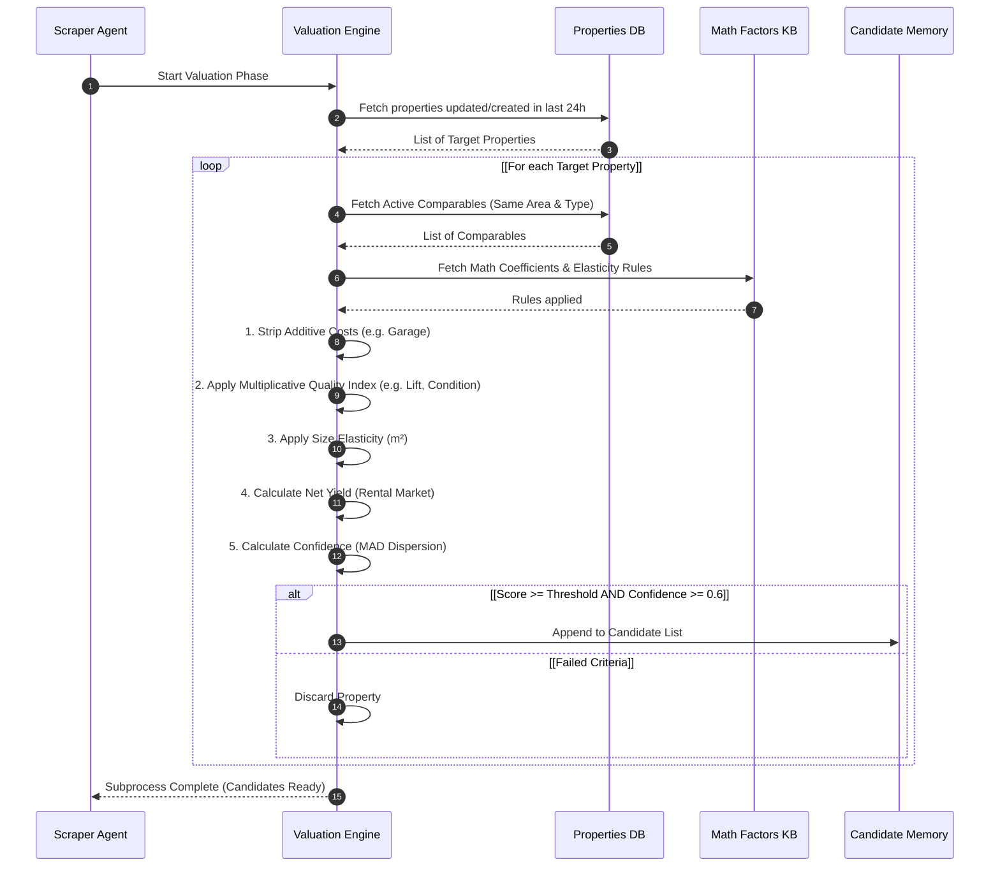

# Subprocess 2: Valuation Engine (Sequence)

```mermaid
%%{init: {'theme': 'default', 'themeVariables': { 'fontFamily': 'ui-sans-serif, system-ui, -apple-system, BlinkMacSystemFont, "Segoe UI", Roboto, "Helvetica Neue", Arial, sans-serif', 'fontSize': '15px' }}}%%
sequenceDiagram
    autonumber
    
    participant Scraper as Scraper Agent
    participant Val as Valuation Engine
    participant DB as Properties DB
    participant KB as Math Factors KB
    participant Mem as Candidate Memory

    Scraper->>Val: Start Valuation Phase
    
    Val->>DB: Fetch properties updated/created in last 24h
    DB-->>Val: List of Target Properties
    
    loop [For each Target Property]
        Val->>DB: Fetch Active Comparables (Same Area & Type)
        DB-->>Val: List of Comparables
        
        Val->>KB: Fetch Math Coefficients & Elasticity Rules
        KB-->>Val: Rules applied
        
        %% Homogenization Steps
        Val->>Val: 1. Strip Additive Costs (e.g. Garage)
        Val->>Val: 2. Apply Multiplicative Quality Index (e.g. Lift, Condition)
        Val->>Val: 3. Apply Size Elasticity (m²)
        Val->>Val: 4. Calculate Net Yield (Rental Market)
        Val->>Val: 5. Calculate Confidence (MAD Dispersion)
        
        alt [Score >= Threshold AND Confidence >= 0.6]
            Val->>Mem: Append to Candidate List
        else [Failed Criteria]
            Val->>Val: Discard Property
        end
    end
    
    Val-->>Scraper: Subprocess Complete (Candidates Ready)
```
