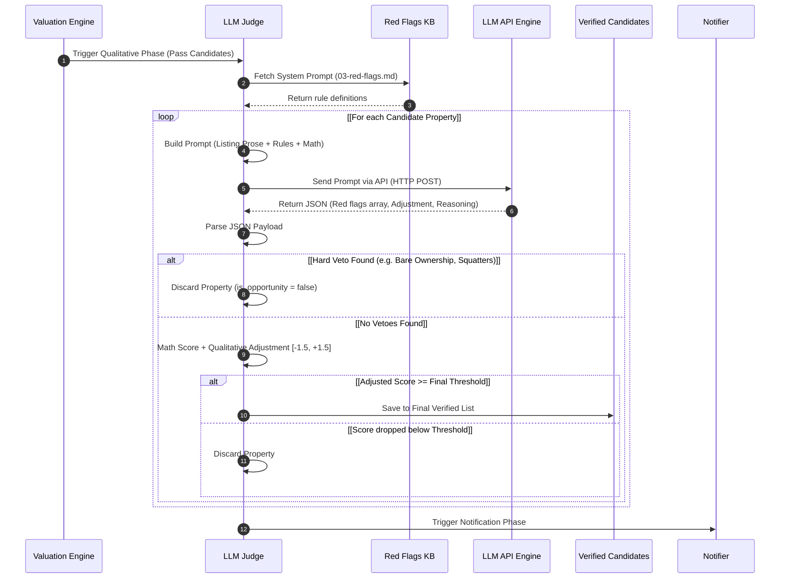

# Subprocess 3: Qualitative Filter (LLM Judge)

```mermaid
%%{init: {'theme': 'default', 'themeVariables': { 'fontFamily': 'ui-sans-serif, system-ui, -apple-system, BlinkMacSystemFont, "Segoe UI", Roboto, "Helvetica Neue", Arial, sans-serif', 'fontSize': '15px' }}}%%
sequenceDiagram
    autonumber
    
    participant Val as Valuation Engine
    participant Judge as LLM Judge
    participant KB as Red Flags KB
    participant IA as LLM API Engine
    participant Mem as Verified Candidates
    participant Notif as Notifier

    Val->>Judge: Trigger Qualitative Phase (Pass Candidates)
    
    Judge->>KB: Fetch System Prompt (03-red-flags.md)
    KB-->>Judge: Return rule definitions
    
    loop [For each Candidate Property]
        Judge->>Judge: Build Prompt (Listing Prose + Rules + Math)
        Judge->>IA: Send Prompt via API (HTTP POST)
        IA-->>Judge: Return JSON (Red flags array, Adjustment, Reasoning)
        
        Judge->>Judge: Parse JSON Payload
        
        alt [Hard Veto Found (e.g. Bare Ownership, Squatters)]
            Judge->>Judge: Discard Property (is_opportunity = false)
        else [No Vetoes Found]
            Judge->>Judge: Math Score + Qualitative Adjustment [-1.5, +1.5]
            
            alt [Adjusted Score >= Final Threshold]
                Judge->>Mem: Save to Final Verified List
            else [Score dropped below Threshold]
                Judge->>Judge: Discard Property
            end
        end
    end
    
    Judge->>Notif: Trigger Notification Phase
```

