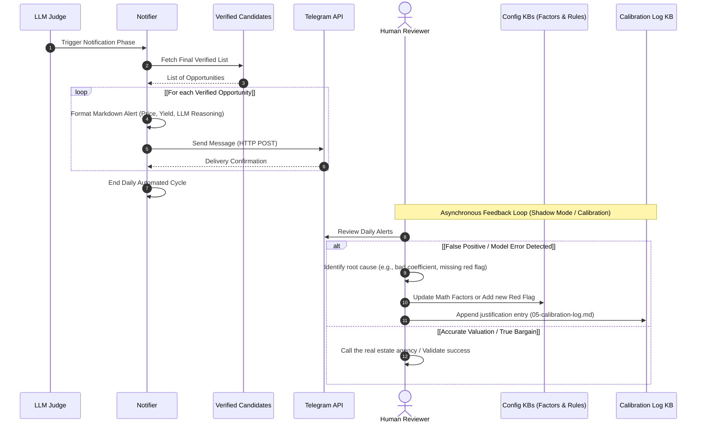

# Subprocess 4: Notification & Calibration Loop

```mermaid
%%{init: {'theme': 'default', 'themeVariables': { 'fontFamily': 'ui-sans-serif, system-ui, -apple-system, BlinkMacSystemFont, "Segoe UI", Roboto, "Helvetica Neue", Arial, sans-serif', 'fontSize': '15px' }}}%%
sequenceDiagram
    autonumber
    
    participant Judge as LLM Judge
    participant Notif as Notifier
    participant Mem as Verified Candidates
    participant TG as Telegram API
    actor User as Human Reviewer
    participant KB_Docs as Config KBs (Factors & Rules)
    participant KB_Log as Calibration Log KB

    Judge->>Notif: Trigger Notification Phase
    
    Notif->>Mem: Fetch Final Verified List
    Mem-->>Notif: List of Opportunities
    
    loop [For each Verified Opportunity]
        Notif->>Notif: Format Markdown Alert (Price, Yield, LLM Reasoning)
        Notif->>TG: Send Message (HTTP POST)
        TG-->>Notif: Delivery Confirmation
    end
    
    Notif->>Notif: End Daily Automated Cycle
    
    %% -----------------------------------------------------------------
    %% Asynchronous Human Feedback Loop (Phase 6: Shadow Mode)
    %% -----------------------------------------------------------------
    Note over User, KB_Log: Asynchronous Feedback Loop (Shadow Mode / Calibration)
    
    User->>TG: Review Daily Alerts
    
    alt [False Positive / Model Error Detected]
        User->>User: Identify root cause (e.g., bad coefficient, missing red flag)
        User->>KB_Docs: Update Math Factors or Add new Red Flag
        User->>KB_Log: Append justification entry (05-calibration-log.md)
    else [Accurate Valuation / True Bargain]
        User->>User: Call the real estate agency / Validate success
    end
```

